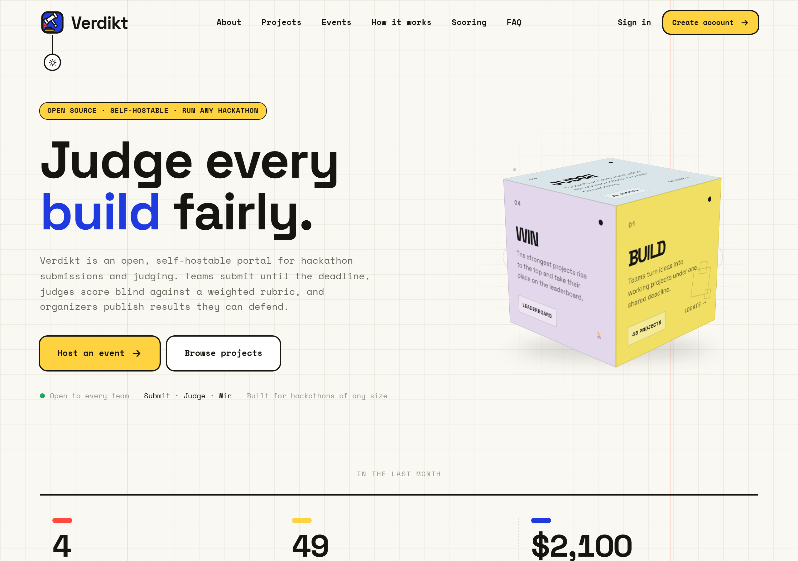
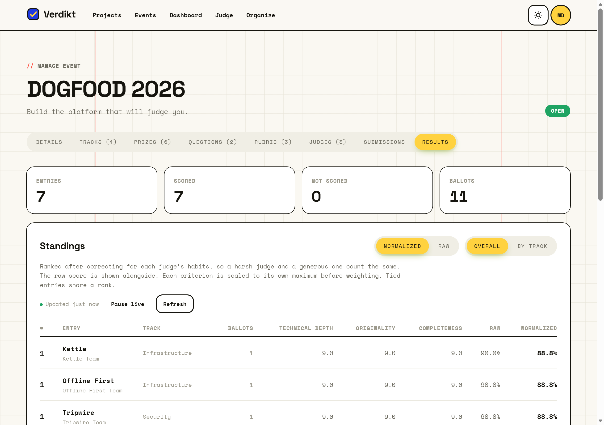
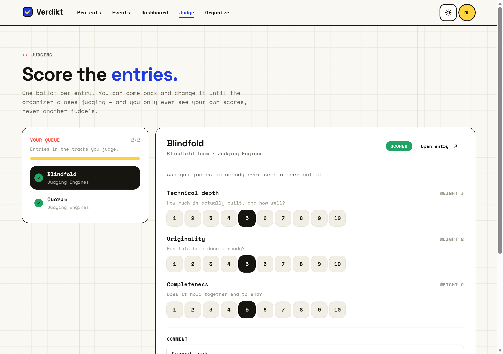

<div align="center">

# Verdikt

### Run a hackathon end to end — and be able to explain the result.

Open-source, self-hosted hackathon platform: sign-ups, teams, submissions,
and judging you can audit. One command, no cloud account.

[](#verify-it-yourself)
[](#whats-built)
[](LICENSE)
[](#architecture)

**[Quick start](#quick-start)** ·
**[Features](#what-it-does)** ·
**[How judging works](JUDGING.md)** ·
**[Verify it](#verify-it-yourself)** ·
**[Architecture](#architecture)** ·
**[Limits](#honest-limits)**



</div>

---

## Why another hackathon platform?

There are good ones already. Devpost, Unstop, DoraHacks and HackerEarth all run
events at a scale Verdikt has not, with polish and a public audience Verdikt
does not have. If you want a managed service and a big shared project gallery,
use one of those — genuinely.

Verdikt makes a different trade:

|  |  |
|---|---|
| **You run it** | Three containers, one `docker compose up`. No account with anyone, no API keys, no third-party identity provider. It works with the network cable pulled. |
| **The judging is written down** | Weighting, normalization, ties, and what each judge may see are specified in **[JUDGING.md](JUDGING.md)** and enforced by the API — not a black box you take on trust. |
| **The maths is measured, not asserted** | `npm run normalization-proof` simulates events with a *known* correct answer and reports how close each scoring method gets — including the case where ours would be the wrong choice. |
| **Your data stays yours** | One MongoDB. `mongodump` is the entire backup story. No export ticket, no retention policy but your own. |

**Roles are per event, not per account.** The same person can organise one
hackathon, judge a track in a second and compete in a third. Every permission
check asks "in *which* event?" — including the ones that stop you judging an
event you entered, and stop an organizer reading another organizer's ballots.

---

## Quick start

```bash
git clone https://github.com/Dogfood-Hackathon-Team-ByteMe/Verdikt.git
cd Verdikt
docker compose up
```

Open **<http://localhost:3000>**. That is the whole setup — the database seeds
itself on first boot with a live event, eight projects, a judging panel and
ballots already cast.

Sign in as any role:

| Role | Email | Password |
|---|---|---|
| Organizer | `organizer@verdikt.dev` | `dogfood2026` |
| Judge | `judge@verdikt.dev` | `dogfood2026` |
| Participant | `participant@verdikt.dev` | `dogfood2026` |
| Admin | `admin@verdikt.dev` | `dogfood2026` |

> **Worth clicking, in this order:** sign in as the **organizer** → *Organize* →
> the seeded event → **Results**. The judges in the seed scored deliberately
> differently, so the Raw and Normalized columns disagree and you can watch the
> correction do something. Then sign in as the **judge** to see that the same
> event shows only their own tracks, and only their own scores.

Restarting keeps your data. To wipe and re-seed:

```bash
docker compose run --rm -e SEED_FORCE=true seed
```

---

## What it does

### For participants

- **Teams by invite link.** No approval queue, no email service required.
- **Draft and edit until the deadline**, enforced by the server — not by hiding
  a button. Once it passes, the API refuses the write whatever the browser
  sends.
- **A public gallery**, searchable and filterable, readable without an account.
- **Image uploads** for avatars, banners and thumbnails, with an in-browser
  crop step so what you frame is what everyone sees.

### For organizers



- **Build the event**: dates, tracks, prizes, team size limits, and your own
  submission questions.
- **Set the rubric**: criteria, weights, and each one's scale. A ballot has to
  score every line, within its own range.
- **Appoint judges per track** — by email if they have an account, or by an
  invite link if they don't. Links are bound to one address, single use, and
  revocable.
- **Deal the batches**: "3 independent reviews per entry", load-balanced across
  the panel and never crossing track boundaries. If a track is short of judges
  the shortfall is reported, rather than quietly filled from elsewhere.
- **Watch it land**: a live dashboard with rankings overall and per track,
  review coverage, and each judge's scoring habits. Entries nobody has opened
  are left explicitly unranked, not sorted last.
- **Export at every stage**: entries, assignments, every ballot, and the final
  standings. Cells are quoted and defused, so an entry titled `=HYPERLINK(...)`
  opens as text in your spreadsheet, not as a formula.

### For judges



- **A queue of exactly what you may score** — your assigned batch, or your own
  tracks if the organizer hasn't dealt batches yet. The page shows what the API
  would accept, so the two cannot disagree.
- **One ballot per entry**, editable until judging closes.
- **You see only your own scores.** Not a peer's, and not the standings — the
  aggregate plus your own ballots would be enough to work out everyone else's.

---

## How judging works

The full method — the arithmetic, the scope rules, the failure cases — is in
**[JUDGING.md](JUDGING.md)**. The short version:

An entry's score is the mean of its ballots. Each ballot is the organizer's
weighted rubric, with every criterion scaled to its own maximum first, so a
1–10 line does not quietly outweigh a 1–5 line of the same weight.

Then **cross-judge normalization**: a harsh judge and a generous one should
count the same, so each ballot is re-expressed relative to the habits of the
judge who cast it, and rescaled onto the group of judges it can actually be
compared with — those who share entries, directly or through a chain of others.

Does that help? Measured over 200 simulated events per scenario where the true
ranking is known (`npm run normalization-proof`), as correlation with truth:

| Scenario | Raw | Textbook z-score | **Verdikt** |
|---|---|---|---|
| Biased judges, entries dealt at random | 0.935 | 0.975 | **0.975** |
| Fair judges, entries dealt at random | 0.986 | 0.977 | **0.977** |
| Biased judges kept to tracks of differing strength | 0.903 | 0.796 | **0.906** |

Read those rows as: it helps a lot when judges are biased, costs a little when
they are not, and — the row that decided the design — the textbook version
*damages* the ranking when judges are kept to their own tracks, because it
flattens real differences between tracks. Grouping is what avoids that. Raw is
always one click away, and both columns are shown side by side.

---

## Verify it yourself

Claims in this README have something behind them. Roughly in order of how long
they take to run:

```bash
# 210 HTTP-level tests, on a throwaway in-memory MongoDB replica set
cd backend && npm install && npm test

# The simulation behind the table above
npm run normalization-proof

# The same suite, writing the receipt to ../acceptance-report.txt
npm run acceptance
```

Every test drives the real Express app over HTTP — nothing calls a service
function directly. What is being checked is that **the API** enforces the
rules, so they still hold when you skip the frontend and use `curl`.

<details>
<summary><b>The frontend contract check</b> — 90 assertions against a live stack</summary>

<br>

```bash
cd Frontend && npm run verify      # needs docker compose up
```

The adapter layer between the API's Mongo shapes and the app's own types is the
risky seam: a renamed backend field fails silently as a blank card rather than
an error. So this bundles the *real* adapters, runs them against a *live*
backend, and asserts the adapted output is what the components expect. It walks
the judging path end to end — rubric, queue, ballot, standings, exports and the
refusals — and cleans up everything it creates.

</details>

<details>
<summary><b>The independent acceptance checker</b> — the graders' own script</summary>

<br>

```bash
cd backend
npm run import-fixtures     # loads a second, already-closed event
npm run dogfood-config      # mints session cookies into .dogfood.toml
cd .. && python run.py .dogfood.toml
```

The imported event's deadline is in the past, so "closed events refuse
submissions" is checked against real closed data rather than asserted.

</details>

**If you are reviewing this**, the evidence for each rubric line lives here:

| Criterion | Where to look |
|---|---|
| Tier completion and correctness | [`acceptance-report.txt`](acceptance-report.txt) · `python run.py .dogfood.toml` · [`.dogfood.toml`](.dogfood.toml) claims only what the acceptance suite proves over HTTP |
| Judging integrity | [JUDGING.md](JUDGING.md) · `backend/services/JudgeScope.js` · `backend/tests/stageF`–`stageJ` |
| Adoptability and operability | This file · `docker compose up` · [ARCHITECTURE.md](ARCHITECTURE.md) · [DATA-MODEL.md](DATA-MODEL.md) |
| Code quality and innovation | `backend/utils/normalization.js` and its proof · the per-event role model in `backend/utils/eventRoles.js` |

---

## What's built

**Tier 1 — core: complete.** Authentication and sessions; per-event roles;
events with configurable dates, tracks, prizes and custom questions; teams by
invite link; draft-and-edit submissions; server-side deadline enforcement; a
public searchable gallery; role checks enforced in the backend.

**Tier 2 — judging: complete.** Judge invites, applications and batch
assignment; the organizer-weighted rubric; role isolation in the backend; the
live organizer dashboard; cross-judge normalization with its method and proof
written down; CSV export at every stage.

**Tier 3 — community: complete.** The anti-abuse floor: rate limiting on
sign-in, registration, writes and the keyless surface, counted per account as
well as per address so one attacker cannot lock out everyone behind a shared
connection; and an append-only audit trail of every change to a panel,
readable by the organizer and by nobody the trail describes. On that floor,
the community layer: one-vote-per-person polling that never touches the judged
standings (your own team, the judges, the organiser and admins cannot vote at
all); public comment threads with organizer moderation, where a removed
comment keeps its slot and says who removed it; and a versioned, keyless,
rate-limited read API — [`API.md`](API.md) — built from allow-lists, so drafts,
rosters and email addresses cannot leak by accident.

**Tier 4: not started.** Webhooks and the rest are untouched.

`.dogfood.toml` claims T1, T2 and T3, because the acceptance report proves all
three over HTTP. The bundled `run.py` checker only carries probes for T1 and
T2, so it verifies those two and lists T3 as claimed on the strength of the
acceptance suite.

---

## Honest limits

Underclaiming beats overclaiming. Read this before running it anywhere real:

- **Rate limit counters live in memory.** They are correct for the single API
  process this ships as, and reset when it restarts. More than one process
  would give each its own counters, so a multi-process deployment needs a
  shared store before the numbers mean anything.
- **Seed passwords are shared and printed to the log.** Fine for a demo; set
  `SEED_PASSWORD` for anything else.
- **No email service.** Team and judge invites are links you send yourself.
- **`isAdmin` is not settable over HTTP**, by design — promote in the database.
- **Normalization cannot correct bias between judges who never overlap.** If
  each track's panel sees only its own track, a harsh panel and a weak track
  look identical in the ballots. Verdikt corrects within each connected group
  and says on the dashboard when there is more than one; overlapping judges
  across tracks is how you close the gap.
- **Nothing decides the winner.** The leaderboard ranks; awarding the prize is
  still a human's job. There is no "publish results" step, so entrants cannot
  yet see where they came.

---

## Architecture

```
browser ──▶ nginx ──▶ Express API ──▶ MongoDB
            serves the SPA,          routes → controllers
            proxies /api             → services → repositories
```

Three containers, no managed services. The web container proxies `/api` to the
backend so everything is same-origin: the session cookie stays
`httpOnly; SameSite=Lax`, with no CORS preflight and no HTTPS requirement for
local use. MongoDB runs as a single-node **replica set**, because several
operations write a document plus a denormalised pointer inside one transaction.

Two documents worth the click: **[ARCHITECTURE.md](ARCHITECTURE.md)** for the
request lifecycle and the per-event role model, and
**[DATA-MODEL.md](DATA-MODEL.md)** for the schema, the indexes, and what is
deliberately *not* stored.

<details>
<summary><b>Local development</b> (without Docker)</summary>

<br>

```bash
# API — needs a MongoDB replica set
cd backend && npm install && npm run dev      # :8080

# Web
cd Frontend && npm install && npm run dev     # :5173
```

Copy `backend/.env.example` to `backend/.env`. For the frontend, set
`VITE_API_URL=http://localhost:8080` in `Frontend/.env` — or leave it unset to
run the UI on built-in sample data with no backend at all.

Borrow the bundled replica set with `docker compose up mongo`. A standalone
`mongod` works too; the transactional writes fall back to non-atomic with a
logged warning.

</details>

<details>
<summary><b>Project layout</b></summary>

<br>

```
backend/
  routes/ controllers/ services/ repositories/   the request path, in order
  middlewares/  rateLimit.js    who gets counted, and against what
  utils/        rubric.js       ballot rules and weighting
                standings.js    ranking, ties, unjudged entries
                normalization.js (+ normalizationProof.js)
                csv.js          quoting and formula defusing
  tests/        255 HTTP-level tests (stageB … stageJ)
  scripts/      seed.js, import-fixtures.js, dogfood-config.js,
                normalization-proof.js
Frontend/       React + Vite SPA
  src/api/      one adapter layer; nothing Mongo-shaped reaches a component
  src/pages/    judging, organizing, submitting
API.md          the public /api/v1 surface and its three promises
docs/           the screenshots in this file
JUDGING.md      how ballots become a ranking, and the proof
ARCHITECTURE.md system design and the reasoning behind it
DATA-MODEL.md   collections, indexes, import/export
acceptance-report.txt
```

</details>

---

## License

[MIT](LICENSE). Fork it, self-host it, run your own hackathon on it.

<div align="center">
<sub>Built for <b>DOGFOOD 2026</b> by Team ByteMe — the platform that judges itself.</sub>
</div>
